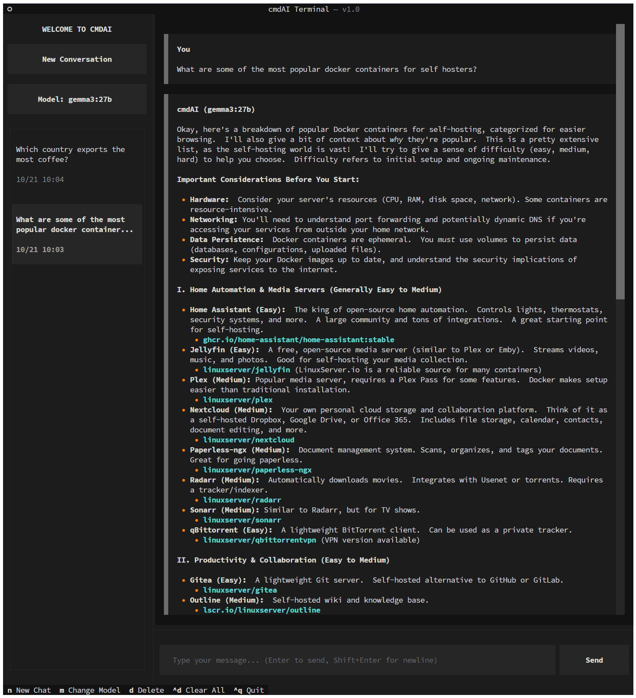
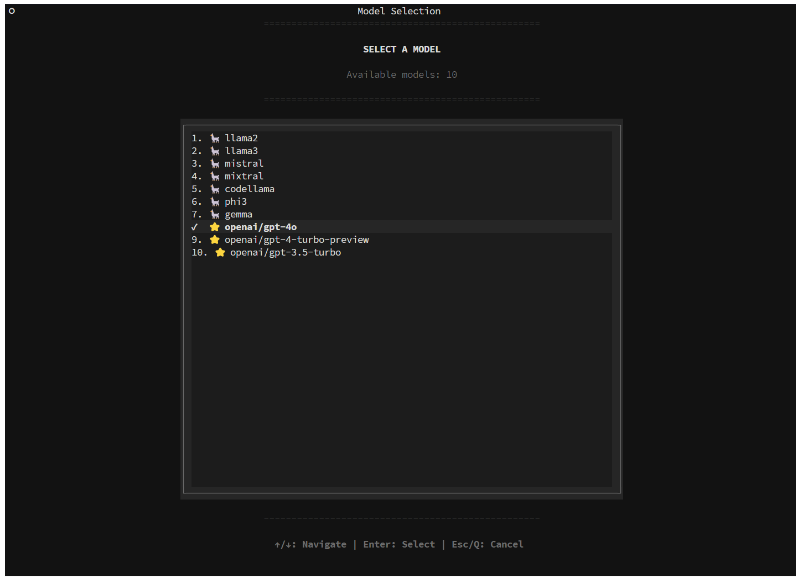

#  cmdAI Terminal v1.0

> A familiar and easy to use terminal interface for OpenAI and/or Ollama

cmdAI Terminal brings the elegance of modern chat interfaces to your terminal, with a carefully crafted dark theme, real-time streaming, and intelligent conversation management. Works seamlessly with both Ollama and OpenAI models.

## 📸 Screenshots


*Main chat interface with sidebar navigation and streaming responses*


*Easy model switching with support for Ollama and OpenAI models*

---

## ✨ Features

### 🎯 Core Experience
- 🖥️ **Beautiful TUI** - Modern terminal interface built with Textual and custom cmdAI dark theme
- ⚡ **Real-time Streaming** - Watch AI responses appear token-by-token as they're generated
- 💬 **Rich Markdown** - Full support for code blocks, tables, lists, headers, and more

### 🔄 Conversation Management
- 📚 **Persistent History** - All conversations automatically saved and resumable
- 🗂️ **Quick Navigation** - Browse and switch between chats in the sidebar
- 🗑️ **Smart Deletion** - Delete individual conversations (d) or clear all (Ctrl+D)
- 📝 **Auto-titling** - First message becomes the conversation title

### 🤖 Model Control
- 🔀 **Instant Switching** - Click model name or press Ctrl+M to change models
- 🦙 **Ollama Support** - Full integration with local Ollama models
- ⭐ **OpenAI Support** - Connect to OpenAI's GPT models with API key
- 💾 **Model Persistence** - Remembers your last selected model between sessions
- 📋 **Dynamic Loading** - Automatically fetches available models from both providers

### ⌨️ Developer Friendly
- ⚡ **Keyboard Shortcuts** - Efficient navigation without touching the mouse
- 🎨 **Clean Minimalist UI** - Distraction-free interface with intuitive interactions
- 📐 **Split-pane Layout** - Sidebar for navigation, main area for focused chatting

---

## 🚀 Quick Start

### Installation

```bash
# Quick install
pip install -e .

# Or install dependencies manually
pip install textual rich httpx pyyaml
```

### Configuration

Create `config.yaml` in your current directory or at `~/.cmdai-terminal/config.yaml`:

```yaml
api:
  ollama:
    base_url: http://localhost:11434  # Your Ollama API endpoint
    timeout: 60
  openai:
    api_key: sk-your-key-here  # Optional: Add your OpenAI API key
    timeout: 60

ui:
  theme: dark
  sidebar_width: 35

storage:
  conversations_dir: ~/.cmdai-terminal/conversations

default_model: llama2  # Your preferred model
```

**Note:** Both providers are optional - you can use:
- Only Ollama (leave `api_key: null`)
- Only OpenAI (Ollama endpoint doesn't need to be available)
- Both providers simultaneously for maximum flexibility

### Run It

```bash
cmdai-terminal

# Or if not installed as a package
python3 -m cmdai_terminal
```

---

## ⌨️ Keyboard Shortcuts

| Key | Action | Description |
|-----|--------|-------------|
| **Ctrl+N** | New Chat | Start a fresh conversation |
| **Ctrl+M** | Change Model | Open model selector |
| **Ctrl+Q** | Quit | Exit the application |
| **Enter** | Send | Send your message |
| **Esc** | Cancel | Close dialogs/cancel actions |
| **d** | Delete | Delete selected conversation |
| **Ctrl+D** | Clear All | Delete all conversations |
| **↑/↓** | Navigate | Browse conversations/options |

---

## 📁 Project Structure

```
cmdai-terminal/
├── 📄 pyproject.toml              # Project dependencies & metadata
├── ⚙️ config.yaml                 # User configuration
├── 📚 cmdai_terminal/
│   ├── 🚀 __main__.py            # Entry point
│   ├── 🎨 app.py                 # Main Textual application & UI
│   ├── ⚙️ config.py              # Configuration management
│   ├── 🌐 api/
│   │   ├── ollama.py             # Ollama API client & streaming
│   │   ├── openai_client.py      # OpenAI API client & streaming
│   │   └── unified_client.py     # Unified client for both providers
│   ├── 🧩 components/
│   │   ├── sidebar.py            # Sidebar navigation component
│   │   ├── chat_view.py          # Chat display with markdown
│   │   └── input_box.py          # Message input component
│   ├── 📦 models/
│   │   ├── conversation.py       # Conversation data model
│   │   └── message.py            # Message data model
│   └── 💾 storage/
│       └── history.py            # Conversation persistence (JSON)
```

---

## 🔌 API Compatibility

cmdAI Terminal works with both **Ollama** and **OpenAI** API endpoints. More will be added asap, such as Claude, Gemini etc.

### Ollama API

| Endpoint | Method | Purpose |
|----------|--------|---------|
| `/api/tags` | GET | List available models |
| `/api/chat` | POST | Chat completions with streaming |

**Request Format:**
```json
{
  "model": "llama2",
  "messages": [
    {"role": "user", "content": "Hello!"},
    {"role": "assistant", "content": "Hi! How can I help?"}
  ],
  "stream": true
}
```

**Response Format:** NDJSON with `{"message": {"content": "token"}}`

### OpenAI API

| Endpoint | Method | Purpose |
|----------|--------|---------|
| `/v1/models` | GET | List available models |
| `/v1/chat/completions` | POST | Chat completions with streaming |

**Request Format:**
```json
{
  "model": "gpt-4o",
  "messages": [
    {"role": "user", "content": "Hello!"}
  ],
  "stream": true
}
```

**Response Format:** SSE with `data: {"choices": [{"delta": {"content": "token"}}]}`

### Model Selection

- **Ollama models:** Display as `🦙 model-name` (e.g., `🦙 llama2`)
- **OpenAI models:** Display as `⭐ openai/model-name` (e.g., `⭐ openai/gpt-4o`)
- The app automatically routes to the correct provider based on model prefix

---

## 🐛 Troubleshooting

### 🔴 Cannot connect to Ollama API

**Symptoms:** Ollama models not loading

**Solutions:**
1. ✅ Verify your API is running: `curl http://localhost:11434/api/tags`
2. ✅ Check `config.yaml` has the correct `ollama.base_url`
3. ✅ Ensure firewall allows the connection
4. ✅ Try increasing the `timeout` value in config

### 🔴 Cannot connect to OpenAI API

**Symptoms:** OpenAI models not loading or showing errors

**Solutions:**
1. ✅ Verify your API key is valid: Check at https://platform.openai.com/api-keys
2. ✅ Ensure `api_key` is set in `config.yaml` under `api.openai.api_key`
3. ✅ Check you have credits/quota available in your OpenAI account
4. ✅ Try increasing the `timeout` value in config

### 🔴 Models not loading

**Symptoms:** Only seeing default model, no model list

**Solutions:**
1. ✅ Check both provider configurations in `config.yaml`
2. ✅ Verify at least one provider is properly configured
3. ✅ App will use fallback models if both APIs are unavailable
4. ✅ Look for error messages in the terminal output

### 🔴 Conversations not saving

**Symptoms:** Chats disappear after closing app

**Solutions:**
1. ✅ Check directory exists: `ls ~/.cmdai-terminal/conversations/`
2. ✅ Verify write permissions: `touch ~/.cmdai-terminal/test`
3. ✅ Use proper home expansion in config (`~/.cmdai-terminal/...`)

### 🔴 Streaming not working

**Symptoms:** Messages appear all at once instead of token-by-token

**Solutions:**
1. ✅ Verify API supports streaming responses
2. ✅ Check network isn't buffering responses
3. ✅ Ensure `stream: true` in API request

---

## 🤝 Contributing

Contributions are welcome! Feel free to:

- 🐛 Report bugs
- 💡 Suggest features
- 🔧 Submit pull requests
- 📖 Improve documentation

---

## 📄 License

MIT License - Feel free to use this project however you'd like!

---

## ⭐ Show Your Support

If you find cmdAI Terminal useful, please consider:
- ⭐ Starring the repository
- 🐛 Reporting bugs
- 💡 Suggesting new features
- 📢 Sharing with others


